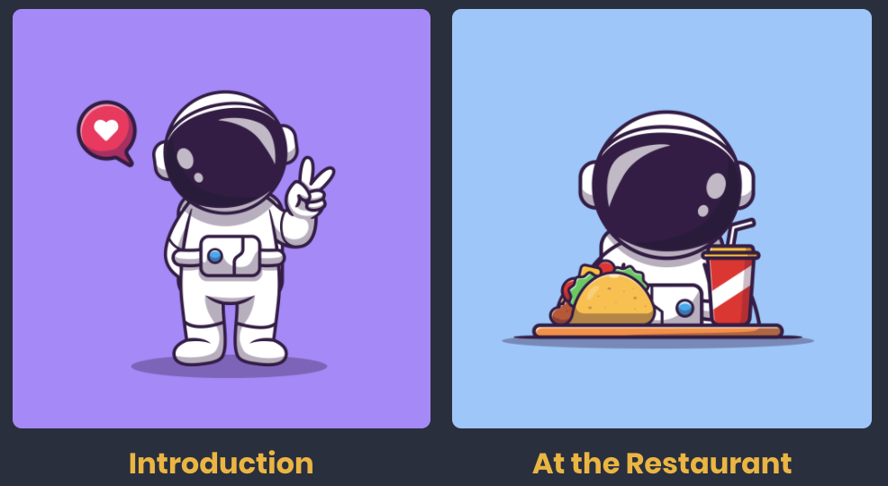
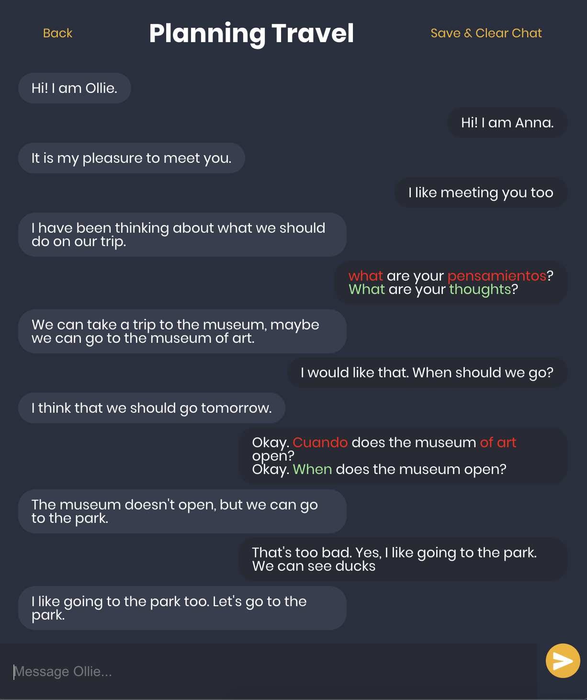
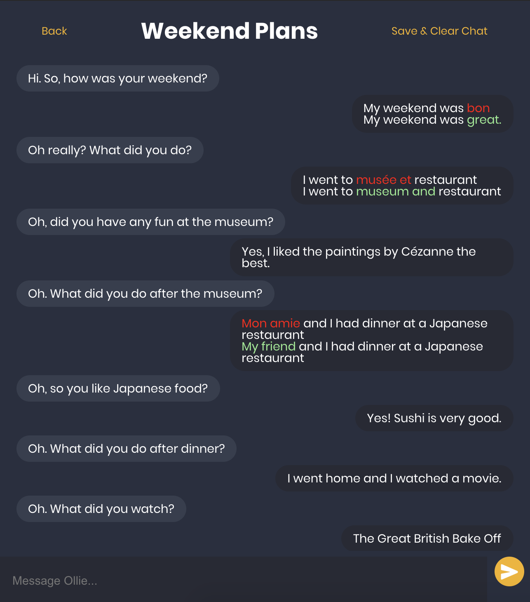

# Learn with Ollie
Ollie is a chatbot that helps you learn languages! Ollie will engage in simple conversations with you to practice scenarios from daily life, like introductions, planning trips, and ordering food at the restaurant.

Ollie currently speaks in English and can converse with users whose native languages are Spanish, French, and German. Ollie will correct your grammar and convert any words you type in your native language to English. The next time you're racking your brain for what the English word or phrase is, you can just type in your native language rather than pull up a translation app.

 
 

Ollie learned to speak with GPT-3, so excuse any responses that may seem a bit strange.

## Descripción en español

Ollie es un chatbot que te ayuda a aprender idiomas. Ollie entablará conversaciones sencillas contigo para practicar escenarios de la vida diaria, como presentaciones, planificar viajes y pedir comida en el restaurante.

Ollie habla actualmente en inglés y puede conversar con usuarios cuyos idiomas nativos son español, francés y alemán. Ollie corregirá tu gramática y convertirá cualquier palabra que escribas en tu idioma nativo al inglés. La próxima vez que se dedique a averiguar cuál es la palabra o frase en inglés, puede escribir en su idioma nativo en lugar de abrir una aplicación de traducción.

## Description française

Ollie est un chatbot qui vous aide à apprendre les langues! Ollie s'engagera dans des conversations simples avec vous pour pratiquer des scénarios de la vie quotidienne, comme les présentations, la planification de voyages et la commande de nourriture au restaurant.

Ollie parle actuellement anglais et peut converser avec des utilisateurs dont les langues maternelles sont l'espagnol, le français et l'allemand. Ollie corrigera votre grammaire et convertira tous les mots que vous saisissez dans votre langue maternelle en anglais. La prochaine fois que vous vous demanderez ce qu'est le mot ou la phrase anglais, vous pouvez simplement taper dans votre langue maternelle plutôt que de lancer une application de traduction.

## Deutsche Beschreibung

Ollie ist ein Chatbot, mit dem Sie Sprachen lernen können! Ollie führt einfache Gespräche mit Ihnen, um Szenarien aus dem täglichen Leben zu üben, z. B. Einführungen, Ausflüge planen und Essen im Restaurant bestellen.

Ollie spricht derzeit Englisch und kann sich mit Benutzern unterhalten, deren Muttersprachen Spanisch, Französisch und Deutsch sind. Ollie korrigiert Ihre Grammatik und konvertiert alle Wörter, die Sie in Ihrer Muttersprache eingeben, in Englisch. Wenn Sie sich das nächste Mal den Kopf zerbrechen, was das englische Wort oder die englische Phrase ist, können Sie einfach Ihre Muttersprache eingeben, anstatt eine Übersetzungs-App aufzurufen.

Illustrations designed by @catalyststuff on Freepik
